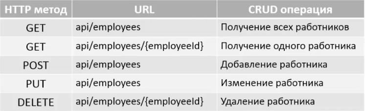

# Spring REST
REST - REpresentational State Transfer. Это способ коммуникации между приложениями. Он описывает стандарты, используя которые, клиент взаимодействует с сервером через HTTP протокол.

Для преобразования объекта в JSON в Spring используется Jackson. Данные из объекта берутся с помощью геттеров объекта, ключ в JSON соответствует полю в объекте. Из JSON в объект поля "перемещаются" с помощью сеттеров.

## GET, POST
Метод гет передает всю информацию в URL, метод пост - передает всю инфу в теле самого http-запроса.
Гет ограничен максимальной длиной, пост не ограничен.
Гет не поддерживает передачу бинарных данных, пост поддерживает.
С помощью гет можно поделиться ссылкой, с помощью пост нельзя.
Как правило, гет используется для получения информации, пост - для отправки информации.

В аннотации @RequestMapping можно указать, какой http-запрос должен вызываеть метод контроллера. Например, для GET:
```java
@RequestMapping(path="/showDetails", method = RequestMethod.GET)

// Или еще проще
@GetMapping("showDetails")

// Для POST
@PostMapping("showDetails")
```

Указать метод в форме можно следующим образом:
```
<form:form action="showDetails" modelAttribute="employee" method="post">
```

### HTTP-запросы и ответы
HTTP-запрос состоит из:
- Request line. HTTP-метод и адрес.
- Zero or more headers. Метаданные о запросе.
- Empty line. Разделяет заголовок и тело.
- Message body (optional). Полезная нагрузка.

HTTP-ответ состоит из:
- Status line. Код статуса и текст статуса.
- Zero or more headers. Метаданные об ответе.
- Empty line. Разделяет заголовок и тело.
- Message body (optional). Полезная нагрузка.

### Коды статуса HTTP-ответа
1хх - Informational. Запрос получен, и процесс продолжается.
2хх - Success. Запрос успешно получен, понят, принят,
3хх - Redirection. Юбя выполнения запроса необходимо предпринять дальнейшие действия.
4хх - Client Error. Запрос содержит неверный синтаксис или не может быть выполнен.
5хх - Server error. Серверу не удалось выполнить корректный запрос.

### Стандарты REST API
При именовании юрл и действий следует придерживаться следующих правил:


Ни в коем случае не стоит прописывать в юрл действие, например /api/getAllEmployees. За круд-операции отвечает http-метод, а не путь в юрл.

### Конфигурируем приложение
Конфигурировать будем на основе джава-кода без использования xml.
Создаем новый проект из maven-артефакта maven webapp. Меняем source, target на 1.8:
```xml
<maven.compiler.source>1.8</maven.compiler.source>
<maven.compiler.target>1.8</maven.compiler.target> 
```

1. Добавляем подключение к БД.  


2. Добавляем зависимости:
- spring-mvc, именно эта зависимость дает поддержку Spring REST
- javax.servlet-api (чтобы работал dispatcher servlet)
- hibernate-core
- DB connector
- C3P0
- spring-orm
- jackson-databind


3. Создаем директорию java, помечаем как Source Root, в ней созаем пакет org.agrokhotov.spring.rest  


4. Создаем файл конфигурации. Он заменяет файл applicationContext.xml. 
- Помечаем его, как конфигурацию
- "включаем" сканирование компонентов, указываем пакет для сканирования. 
- Тэг mvc-annotation-driven заменяется на @EnableWebMvc, таким образом мы "включаем" MVC-аннотации
- "включаем" transaction manager (будет сконфигурирован позднее), заменяя тэг tx:annotation-driven на @EnableTransactionManagement
- Настраиваем конфигурацию БД, создав соответствующий бин.
- Настраиваем sessionFactory, создав соответствующий бин. Для конфигурации Hibernate так же создаем объект Properties.
- Настраиваем transaction manager (чтобы не открывать и закрывать транзакции вручную), создав соответствующий бин.


5. Так как мы не используем web.xml, нужно убедиться, что у нас подключен maven-war-plugin. И поэтому же нужно создать еще один файл конфигурации MyWebInitializer.java, отвечающий за настройки dispatcher servlet'a (aka Front Controller, часть MVC).  


6. Добавляем Томкат.

### Получение списка работников
Создаем новый контроллер, прописываем request mapping, внедряем сервис:
```java
@RestController
@RequestMapping("/api")
public class MyRestController {
    @Autowired
    private EmployeeService employeeService;
}
```
Добавляем метод, возвращающий всех работников, прописываем ему соответсвующую аннотацию:
```java
@GetMapping("/employees")
public List<Employee> getAllEmployees() {
    return employeeService.getAllEmployees();
}
```


### Получение одного работника
Для получения работника по id используется аннотация @PathVariable:
```java
@GetMapping("/employee/{id}")
public Employee getEmployee(@PathVariable int id) {
    return employeeService.getEmployee(id);
}
```

### Обработка исключений
Создадим отдельный пакет под исключения exceptions.   
Создаем класс EmployeeIncorrectData.   
Создаем исключение NoSuchEmployeeException. Переопределяем конструктор с сообщением.   
Обрабатываем исключение в соответствующем методе контроллера.  

Нам также требуется exception handler, который будет заполнять JSON сообщением с исключением. Создаем метод и помечаем его аннотацией @ExceptionHandler. Метод параметризирован классом EmployeeIncorrectData, это тип объекта, который добавляется в HTTP response body. Метод принимает аргументом требуемое исключение NoSuchEmployeeException и возвращает ResponseEntity, обертку над HTTP response.

Чтобы реагировать на другие исключения, можно перегрузить метод exception handler, оставив ему то же имя, но изменив передаваемый аргумент с NoSuchEmployeeException на Exception и поменяв http status code на более подходящий. Тогда исключения с ненайденным Employee и все остальные исключения будут обрабатываться с разными сообщениями. 